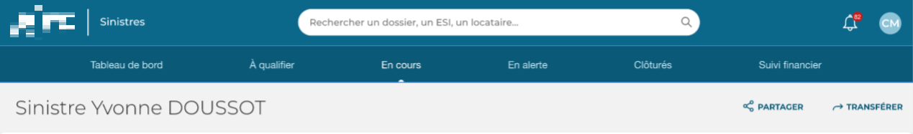
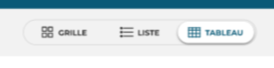
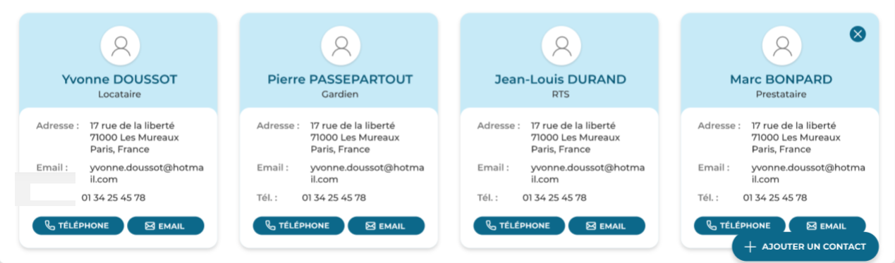
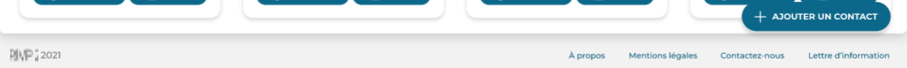

# Sinistres 

**Sinistres** is a project I worked on with a team of developers in charge of the project during my internship at the company "Digiwin".
**Digiwin** is a company that develops applications and softwares for clients. So in those screenshots the name of the client is blured for confidentiality reasons.

This internship took place from **January 10, 2022 to April 8, 2022.**

The purpose of **Sinistres** is to manage the repairs to be carried out as a result of Claims.

When I worked with the **Sinistres** team I took care of the Front-End part of the project.

I had several missions to carry out on this platform:

I took care of creating the ```<header>``` of the application.




the ```<Display-Switch>``` part in the header : 





the ```Display in Cards``` :





to be used with the ```<Display-Switch>``` and the ```<Footer>``` : 





Working on **Sinistres** made me discover and learn **Angular** and how to use this framework. Working on the header was a good thing to discover this framework.

The ```<Display-Switch>``` component is using ```@Output``` and ```@Input```. This is a feature of Angular that is useful to transfer datas from child component to a parent component or the contrary.
So the ```<Display-Switch>``` component is sending datas to the ```<Table>``` component, so it switches from display in Table or in a Grid.

On the mockups there is 3 differents **display modes** but during the developement of the application there was only two displaying mods : Table and Grid.

The Display Mode in Table was already made when I joined the project so I only made the Cards Display Mode.
So this component is made of cards that takes datas from the database and display one card by line of the Database.

And finally I worked on the ```<Footer>``` of the application that is just a component that appears on every pages with somme links inside.

Since this project was ordered by one of **Digiwin**'s clients, I don't have the rights to share any code or the name of the client, I only shared some explanations on what I've done and some screenshots of the **Mockups** made on **Adobe XD**.

Thank you.
